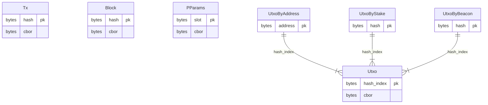

### Rationale

There are ledger queries that are strictly required for validation and consensus of the chain, we consider these "core queries". There's another group of queries that are not strictly required for validation (at least in the current state of affairs) but are useful for dApps using Dolos as data-source, we consider these "extra queries".

### Use cases
These are what we _assume_ as potential use-cases that we want to support:

- get chain tip (last block) for defining validity periods
- get chain parameters for building txs
- get utxos from a particular address for coin selection algorithms
- get utxo by reference to resolve inputs of past txs
- get tx by hash for traceability purposes
- get block by hash for traceability purposes
- get utxo by beacon (nft) for distributed app tx building

### Use cases that need refinement:
These are some other use-cases that might be useful but need further discussion.

- get utxo that hold a particular datum?
- get datum by hash?
- get script by hash?
- get epoch info?

### Out-of-scope
We won't include queries for the following areas of the ledger since we don't consider them a priority at this stage.

- Staking
- Rewards / Withdrawals
- Pool info

### Entities that need refinement

- Datum
- Scripts
