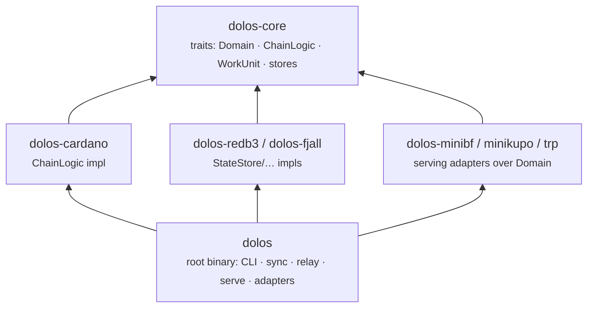

Dolos is a Cargo workspace. The code is split so that generic data-node abstractions, Cardano-specific ledger logic, storage engines, and API servers each live in their own crate and depend on one another in a single direction. This page maps the crates and shows how the main `dolos` binary is organized.

## Workspace crates

| Crate | Path | Purpose |
| ----- | ---- | ------- |
| `dolos-core` | `crates/core/` | Chain-agnostic traits and types: `Domain`, `ChainLogic`, `WorkUnit`, and the `StateStore` / `ArchiveStore` / `WalStore` / `IndexStore` / `MempoolStore` storage traits. Knows nothing about Cardano. |
| `dolos-cardano` | `crates/cardano/` | The Cardano implementation of the core traits: block processing, ledger state, era rules, epoch transitions, and reward calculations. |
| `dolos-redb3` | `crates/redb3/` | Storage backend built on [redb](https://github.com/cberner/redb) (embedded, ACID, B+tree). Implements WAL, state, archive, indexes, and mempool. |
| `dolos-fjall` | `crates/fjall/` | Storage backend built on [fjall](https://github.com/fjall-rs/fjall) (LSM-tree), an alternative for write-heavy state and index stores. |
| `dolos-minibf` | `crates/minibf/` | Blockfrost-compatible HTTP API server. |
| `dolos-minikupo` | `crates/minikupo/` | Kupo-compatible HTTP API for datum/script resolution and pattern matching. |
| `dolos-trp` | `crates/trp/` | Transaction Resolver Protocol (Tx3) JSON-RPC server. |
| `dolos-testing` | `crates/testing/` | Shared test utilities and fixtures. |
| `xtask` | `xtask/` | Developer automation (`cargo xtask …`): test instances, ground-truth generation, DBSync queries. |
| `dolos` (root) | `src/` | The binary crate: CLI, sync pipeline, relay, serve orchestration, and the runtime adapters that wire everything together. |

The API-server crates and several subsystems are gated behind Cargo features. The default build enables `mithril`, `utils`, `grpc`, `minibf`, `minikupo`, and `trp`, so a standard `dolos` binary ships with every API surface. `dolos-trp` is an optional feature-gated dependency rather than a workspace member.

## Dependency layering

Dependencies point in one direction — from concrete implementations toward the abstract core. Nothing in `dolos-core` depends on a storage engine or an API server.

The root binary is the only place that picks concrete backends and API servers and assembles them into a running node.

## The `dolos` binary

The binary lives in `src/bin/dolos/` and dispatches a set of top-level subcommands:

| Command | What it does |
| ------- | ------------ |
| `init` | Interactive wizard to generate configuration. |
| `daemon` | Full node — runs the sync pipeline and all enabled API servers together. |
| `sync` | Sync only — pull blocks from the upstream peer and apply them to the ledger. |
| `serve` | Serve only — expose the APIs over already-synced data. |
| `data` | Inspect and export stored data (dump state, logs, blocks, WAL; prune; import archive). |
| `eval` | Evaluate a transaction against current ledger state (phase-1 and phase-2). |
| `doctor` | Diagnose and repair (WAL integrity, rollback, reset genesis/WAL, catch-up stores). |
| `bootstrap` | Initialize a node from a Mithril snapshot, a Dolos snapshot, or a relay. |

The `daemon`, `sync`, and `serve` commands map directly onto the sync pipeline and serving layer described in the following pages. For how to choose between them operationally, see [Operations → Modes](../operations/modes); for `bootstrap`, see the [Bootstrap section](../bootstrap).

## Key dependencies

Dolos leans on a small number of foundational crates:

- **[Pallas](https://github.com/txpipe/pallas)** — Cardano building blocks: CBOR codecs, ledger primitives, the Ouroboros mini-protocols, and phase-2 (Plutus) evaluation.
- **[gasket](https://github.com/construkts/gasket-rs)** — the staged, concurrent pipeline framework used by the sync loop.
- **redb** and **fjall** — the embedded storage engines behind the two storage backends.
- **tokio** — the async runtime shared by the pipeline and every API server.
- **tonic** (gRPC), **axum** (Mini-Blockfrost, Mini-Kupo), and **jsonrpsee** (TRP) — the serving frameworks.
