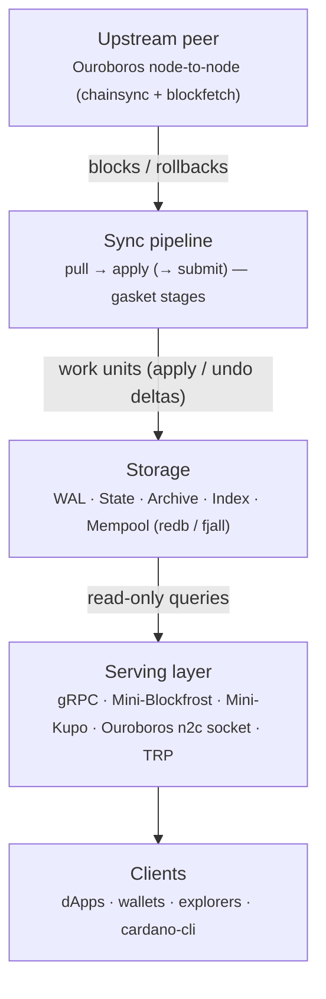

This section describes how Dolos is built. It is a macro view of the system — the layers, the crates, the storage engine, the sync pipeline, and the serving layer — meant for contributors, integrators, and operators who want to understand the internals without reading the source. It is not an API reference; for endpoint-level detail see the [APIs section](../apis/grpc).

Dolos is a data node, not a consensus node. It connects to the Cardano network as an Ouroboros peer, keeps an up-to-date copy of the ledger, and serves that data through several query interfaces. Everything in the architecture follows from that goal: read the chain efficiently, keep resource usage low, and expose the result through the tools developers already use.

## A layered system

At the highest level, data flows in one direction — from an upstream peer, through the sync pipeline, into local storage — and is then read back out by the serving layer.

Each layer is covered in its own page:

- [Crates & Modules](./crates) — how the codebase is split into a Cargo workspace.
- [Data Layer](./data-layer) — the stores, their traits, and the pluggable storage backends.
- [Sync Pipeline](./sync-pipeline) — how blocks get from the network into storage.
- [Ledger Model & Epoch Transitions](./ledger-model) — how Cardano ledger state evolves.
- [Serving Layer & APIs](./serving-layer) — how the query interfaces read that state.

## Chain-agnostic core, Cardano implementation

The most important structural idea in Dolos is the split between a **generic core** and a **chain-specific implementation**.

The `dolos-core` crate defines the abstractions that any UTxO blockchain data node needs, as a set of traits: `Domain` (the umbrella that bundles all the stores together), `ChainLogic` (how blocks turn into state changes), `WorkUnit` (a unit of pipelined ledger work), and the storage traits `StateStore`, `ArchiveStore`, `WalStore`, `IndexStore`, and `MempoolStore`. None of this code knows anything about Cardano specifically.

The `dolos-cardano` crate implements those traits for Cardano — block parsing, ledger rules, epoch transitions, and reward calculations. Everything else in the system is either a **storage backend** (an implementation of the store traits, e.g. `dolos-redb3` or `dolos-fjall`) or a **serving adapter** (an implementation of an API surface that reads from a `Domain`). This is what keeps the sync pipeline, the storage engine, and the API servers decoupled from each other and from the ledger rules.

## One domain, shared by sync and serve

At runtime the whole node is wired together by a single `DomainAdapter` (in `src/adapters/`), which holds handles to every store plus the live Cardano ledger state (`Arc<RwLock<CardanoLogic>>`). The sync pipeline takes the write side of that lock to apply blocks; the serving layer takes read handles to answer queries concurrently. A tip broadcast channel lets streaming endpoints (chain follow, watch) react to new blocks as they are applied.

Because state, archive, and index writes are committed as the pipeline advances, the serving layer reads an up-to-date view without the two sides blocking each other. Commits to the individual stores are sequential rather than atomic across stores, so a reader can briefly observe one store slightly ahead of another while a block is being applied.

## Trust model

Dolos relies on an honest upstream peer for block data — it validates transactions (phase-1 and phase-2) but does not run consensus or independently verify block production. This is the deliberate tradeoff that lets it stay lightweight. For the full rationale, see [What is Dolos](../what).
