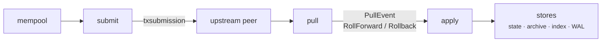

The sync pipeline is how Dolos gets blocks from the Cardano network into local storage and keeps the ledger in step with the chain tip. It connects to an upstream peer over Ouroboros, streams blocks through a small staged pipeline, and applies each one to the stores as reversible work.

## Connecting to the network

Dolos speaks the Ouroboros **node-to-node** mini-protocols via Pallas:

- **chainsync** — follows the upstream peer's chain, receiving block headers and rollback notifications as the tip advances.
- **blockfetch** — fetches the full block bodies for the headers chainsync announced.

The same protocols run in the other direction too: the `relay/` module (`src/relay/`) lets Dolos *serve* chainsync and blockfetch to downstream peers, so a node can act as a relay for others.

## Staged pipeline

Synchronization runs as a [gasket](https://github.com/construkts/gasket-rs) pipeline — independent stages connected by bounded channels, which gives natural backpressure when one stage is slower than another. The stages live in `src/sync/`:



- **pull** (`pull.rs`) — drives chainsync and blockfetch. It validates header continuity (parent hash, slot order) against a chain fragment, fetches bodies, and emits `PullEvent::RollForward(block)` or `PullEvent::Rollback(point)`.
- **apply** (`apply.rs`) — consumes those events and applies them to the ledger via the domain's roll-forward / rollback entry points. It also triggers periodic housekeeping.
- **submit** (`submit.rs`) — the reverse path: it takes transactions from the mempool and offers them to the upstream peer over the txsubmission protocol.

On a local devnet, pull + apply are replaced by an `emulator` stage that produces blocks on an interval instead of fetching them from a peer.

## Applying a block (roll forward)

When the apply stage receives a block, the Cardano chain logic turns it into one or more **work units** — the pipelined unit of ledger work defined by `dolos-core`'s `WorkUnit` trait. Each work unit runs through a fixed lifecycle:

```
initialize → load (per shard) → commit_state → commit_archive → commit_indexes → finalize → tip_events
```

- `initialize` loads the context the unit needs.
- `load` does the actual computation, optionally split across shards for parallelism.
- the `commit_*` steps write the resulting deltas into the state, archive, and index stores.
- `finalize` runs any global post-processing; the chain cursor is advanced here (only at an epoch start).
- `tip_events` emits notifications so streaming API clients see the new tip.

The kinds of work a Cardano block produces — ordinary block application, reward updates, and the two halves of an epoch boundary — are covered in the [Ledger Model](./ledger-model).

## Rolling back

Cardano chains can reorganize, so any applied block may later be undone. Dolos handles this without recomputation: the WAL stores each recent block as a set of `EntityDelta`s that know how to reverse themselves. To roll back to a point, the apply stage reads WAL entries from the current tip backward and applies each delta's inverse, restoring the exact prior state, then resets the cursor to the target point.

This is why the WAL exists as a separate store — it is the bounded buffer of reversible history that makes rollbacks precise. See the [Data Layer](./data-layer) for how it is stored.

## Housekeeping

As the tip advances, the pipeline periodically prunes history it no longer needs — trimming the WAL and, in sliding-history mode, the archive — according to the configured retention window. The `dolos doctor` and `dolos data` commands expose the same maintenance operations for manual use.

Source: `src/sync/{mod,pull,apply,submit,emulator}.rs`, `src/relay/*`, and the `WorkUnit` / roll traits in `crates/core/src/{work_unit,sync}.rs`.
